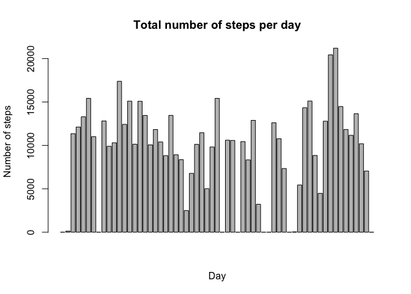
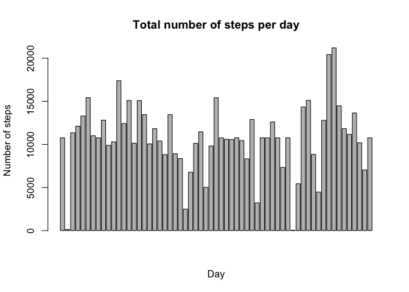

# Reproducible Research: Peer Assessment 1


## Loading and preprocessing the data


```r
##  Load dependencies
library(dplyr)
```

```
## 
## Attaching package: 'dplyr'
## 
## The following objects are masked from 'package:stats':
## 
##     filter, lag
## 
## The following objects are masked from 'package:base':
## 
##     intersect, setdiff, setequal, union
```

```r
library(ggplot2)

##  Loading and preprocessing the data
data <- read.csv("activity.csv")
data_by_date <- group_by(data, date)
data_by_interval <- group_by(data, interval)
```

## What is mean total number of steps taken per day?

### Histogram of total number of steps taken each day

```r
TotalSteps <- summarize(data_by_date, sum(steps, na.rm = TRUE))
names(TotalSteps) <- c("Date", "Total_Steps")

plot1 <- barplot(TotalSteps$Total_Steps)
title(main = "Total number of steps per day",
      xlab = "Day",
      ylab = "Number of steps")
```

 

```r
plot1
```

```
##       [,1]
##  [1,]  0.7
##  [2,]  1.9
##  [3,]  3.1
##  [4,]  4.3
##  [5,]  5.5
##  [6,]  6.7
##  [7,]  7.9
##  [8,]  9.1
##  [9,] 10.3
## [10,] 11.5
## [11,] 12.7
## [12,] 13.9
## [13,] 15.1
## [14,] 16.3
## [15,] 17.5
## [16,] 18.7
## [17,] 19.9
## [18,] 21.1
## [19,] 22.3
## [20,] 23.5
## [21,] 24.7
## [22,] 25.9
## [23,] 27.1
## [24,] 28.3
## [25,] 29.5
## [26,] 30.7
## [27,] 31.9
## [28,] 33.1
## [29,] 34.3
## [30,] 35.5
## [31,] 36.7
## [32,] 37.9
## [33,] 39.1
## [34,] 40.3
## [35,] 41.5
## [36,] 42.7
## [37,] 43.9
## [38,] 45.1
## [39,] 46.3
## [40,] 47.5
## [41,] 48.7
## [42,] 49.9
## [43,] 51.1
## [44,] 52.3
## [45,] 53.5
## [46,] 54.7
## [47,] 55.9
## [48,] 57.1
## [49,] 58.3
## [50,] 59.5
## [51,] 60.7
## [52,] 61.9
## [53,] 63.1
## [54,] 64.3
## [55,] 65.5
## [56,] 66.7
## [57,] 67.9
## [58,] 69.1
## [59,] 70.3
## [60,] 71.5
## [61,] 72.7
```
### Mean total number of steps taken per day

```r
mean(TotalSteps$Total_Steps)
```

```
## [1] 9354.23
```

### Median total number of steps taken per day

```r
median(TotalSteps$Total_Steps)
```

```
## [1] 10395
```


## What is the average daily activity pattern?

### Time series plot of 5-minute interval and average number of steps taken

```r
StepsByInterval <- summarize(data_by_interval, mean(steps, na.rm = TRUE))
names(StepsByInterval) <- c("Interval", "Average_steps")

plot(StepsByInterval$Interval, StepsByInterval$Average_steps, type = "l")
```

 

### Which 5-minute interval contains the maximum number of steps?

```r
peakInterval <- filter(StepsByInterval, Average_steps == max(Average_steps))
peakInterval[1,1]
```

```
## [1] 835
```
The peak interval is 835-839 minutes.

## Imputing missing values

### 1. Calculate and report the number of NAs in the data set

```r
numberNA <- summary(data$steps)
numberNA[7]
```

```
## NA's 
## 2304
```

###. 2. + 3. Devise a strategy for filling in missing values and create a new data set
This loop fills in missing values with the mean value for the corresponding 5-minute interval.

```r
fullData <- data
count <- nrow(fullData)
for (i in 1:count) {
        if (is.na(fullData[i,1])==TRUE) {
                fullData[i,1] <- StepsByInterval$Average_steps[StepsByInterval$Interval==fullData[i,3]]
        }
}
```

### 4. Make a histogram of total steps each day with the new data set

```r
full_data_by_date <- group_by(fullData, date)
fullTotalSteps <- summarize(full_data_by_date, sum(steps, na.rm = TRUE))
names(fullTotalSteps) <- c("Date", "Total_Steps")

plot1 <- barplot(fullTotalSteps$Total_Steps)
title(main = "Total number of steps per day",
      xlab = "Day",
      ylab = "Number of steps")
```

 

```r
plot1
```

```
##       [,1]
##  [1,]  0.7
##  [2,]  1.9
##  [3,]  3.1
##  [4,]  4.3
##  [5,]  5.5
##  [6,]  6.7
##  [7,]  7.9
##  [8,]  9.1
##  [9,] 10.3
## [10,] 11.5
## [11,] 12.7
## [12,] 13.9
## [13,] 15.1
## [14,] 16.3
## [15,] 17.5
## [16,] 18.7
## [17,] 19.9
## [18,] 21.1
## [19,] 22.3
## [20,] 23.5
## [21,] 24.7
## [22,] 25.9
## [23,] 27.1
## [24,] 28.3
## [25,] 29.5
## [26,] 30.7
## [27,] 31.9
## [28,] 33.1
## [29,] 34.3
## [30,] 35.5
## [31,] 36.7
## [32,] 37.9
## [33,] 39.1
## [34,] 40.3
## [35,] 41.5
## [36,] 42.7
## [37,] 43.9
## [38,] 45.1
## [39,] 46.3
## [40,] 47.5
## [41,] 48.7
## [42,] 49.9
## [43,] 51.1
## [44,] 52.3
## [45,] 53.5
## [46,] 54.7
## [47,] 55.9
## [48,] 57.1
## [49,] 58.3
## [50,] 59.5
## [51,] 60.7
## [52,] 61.9
## [53,] 63.1
## [54,] 64.3
## [55,] 65.5
## [56,] 66.7
## [57,] 67.9
## [58,] 69.1
## [59,] 70.3
## [60,] 71.5
## [61,] 72.7
```

```r
mean(fullTotalSteps$Total_Steps)
```

```
## [1] 10766.19
```

```r
median(fullTotalSteps$Total_Steps)
```

```
## [1] 10766.19
```
The mean and median values differ from the estimates in the first part of the assignment. Both the mean and median values have increased. Imputing the missing data values leads our estimate for the total number of daily steps to increase.

## Are there differences in activity patterns between weekdays and weekends?

### Create new factor variable for weekday/weekend

```r
fullData$date <- as.character(fullData$date)
fullData$date <- as.Date(fullData$date, "%Y-%m-%d")
fullData <- mutate(fullData, Weekend_Weekday = ifelse(
        weekdays(date) == "Sunday" | weekdays(date) == "Saturday", "weekend", "weekday"))
fullData$Weekend_Weekday <- as.factor(fullData$Weekend_Weekday)

weekendData <- fullData %.% 
        filter(Weekend_Weekday == "weekend") %.% 
        group_by(interval) %.%
        summarize(mean(steps, na.rm = TRUE))
names(weekendData) <- c("Interval", "Average_steps")

weekdayData <- fullData %.% 
        filter(Weekend_Weekday == "weekday") %.% 
        group_by(interval) %.%
        summarize(mean(steps, na.rm = TRUE))
names(weekdayData) <- c("Interval", "Average_steps")
```

### Panel plot containing time series plots for weekdays and weekend

```r
par(mfrow = c(2,1))
plot(weekendData$Interval, weekendData$Average_steps, ylim = c(0,250),
     type = "l", main = "Weekend", ylab = "", xlab = "")
title(ylab = "Average steps", xlab = "Interval")
plot(weekdayData$Interval, weekdayData$Average_steps, ylim = c(0,250),
     type = "l", main = "Weekday", ylab = "", xlab = "")
title(ylab = "Average steps", xlab = "Interval")
```

 

